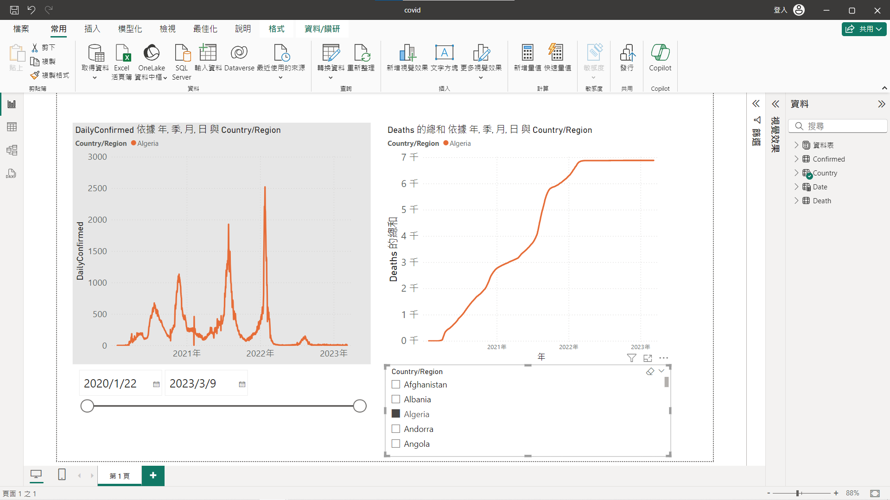
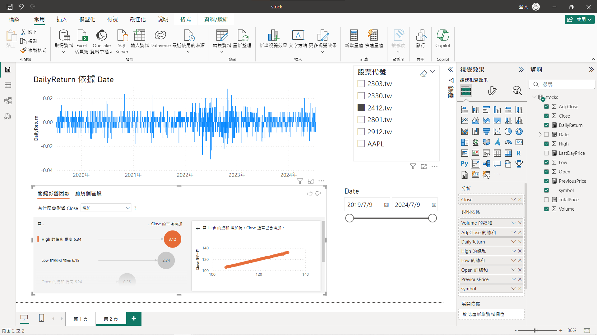
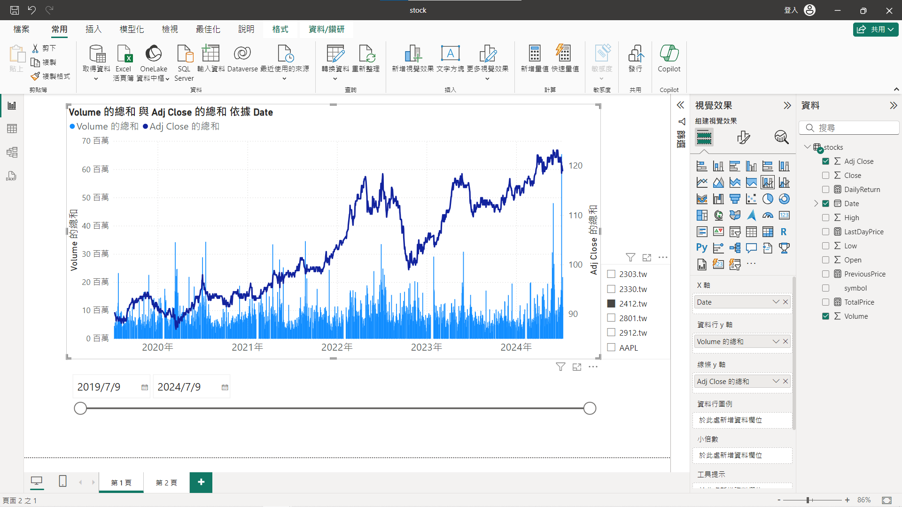
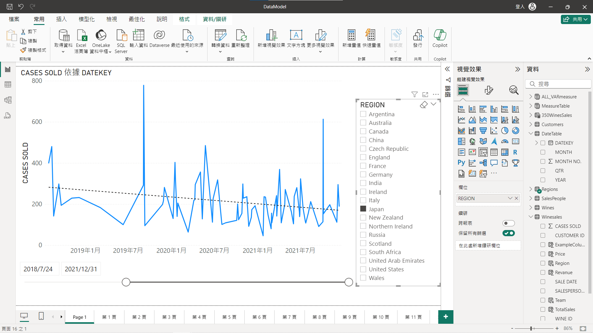
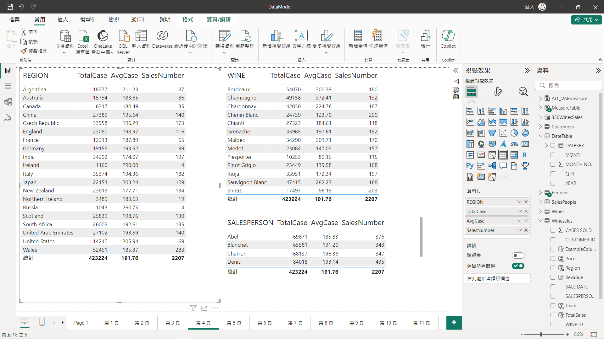
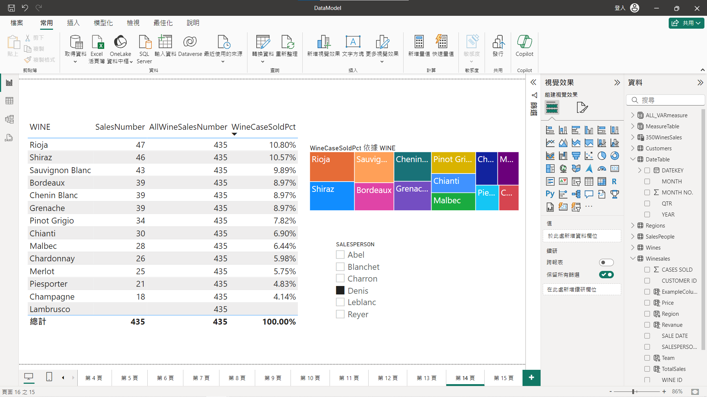

# PowreBI 視覺化數據實作節錄
外訓課程 PowerBI 部分實作資料視覺化截圖

## Covid19 確診與死亡數視覺化

 
- 下方控制區分別為拖曳時間段（左）與選取的國家區域（右）

- 左為該期間的每日確診數走勢

- 右為該期間的每日死亡數走勢

## 股票分析

- 右方控制區為分別為選取的股票代號（上）與期間（下）

- 左上為該檔每日收益率變化

- 左下為該檔與各因數之間的影響分析

- 控制區為分別為選取的股票代號（右）
- 下方為期間

- 圖為該檔每日還原股價變化

## 酒品銷售資料

- 控制區為分別為選取的銷售地區（右）
- 下方為期間

- 圖為該區的銷售案件數變化

- 圖為分析各區域、酒類品種、銷售員，銷售案件數、平均案件數、銷售數量

- 左圖為選取的銷售員對於各酒類品種銷售數量與案件銷售佔比
- 右圖為選取的銷售員對於各酒類品種案件銷售佔比示圖
